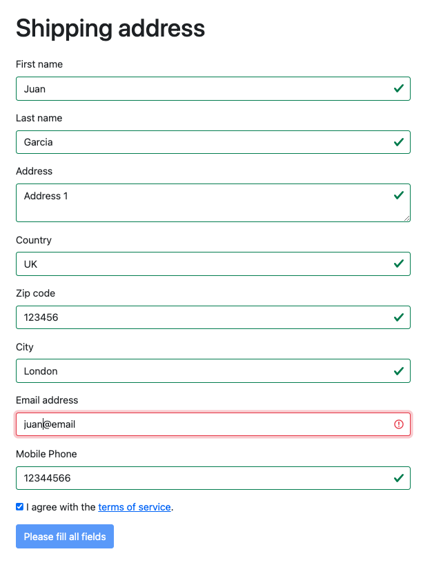

# Form Validation

Custom made validations for a form.

For simplicity, in order to enable the buton, the form only validates that all inputs have a value, the email follows a simple pattern and the checkbox is checked.

This was made using the following tools:

- HTML
- Vanilla JavaScript
- Bootstrap

## Screenshot

